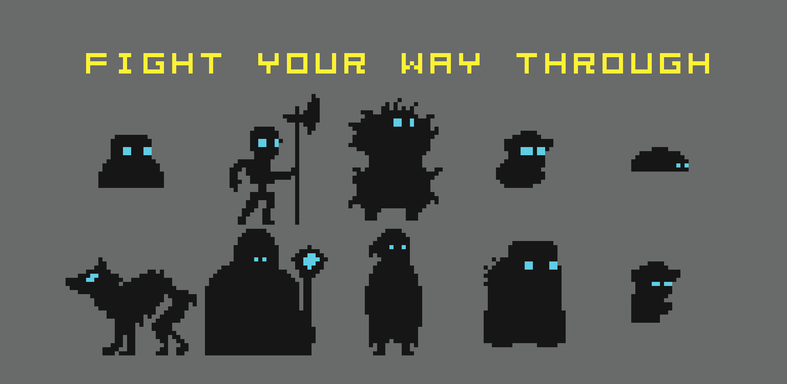
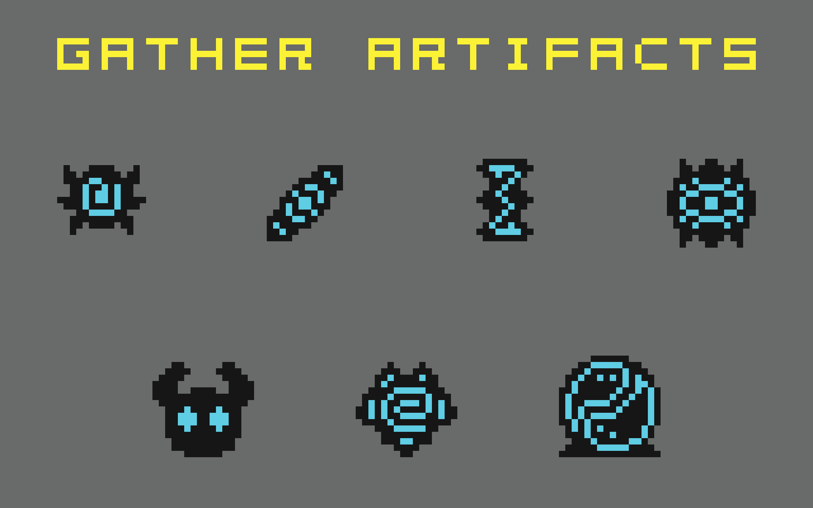
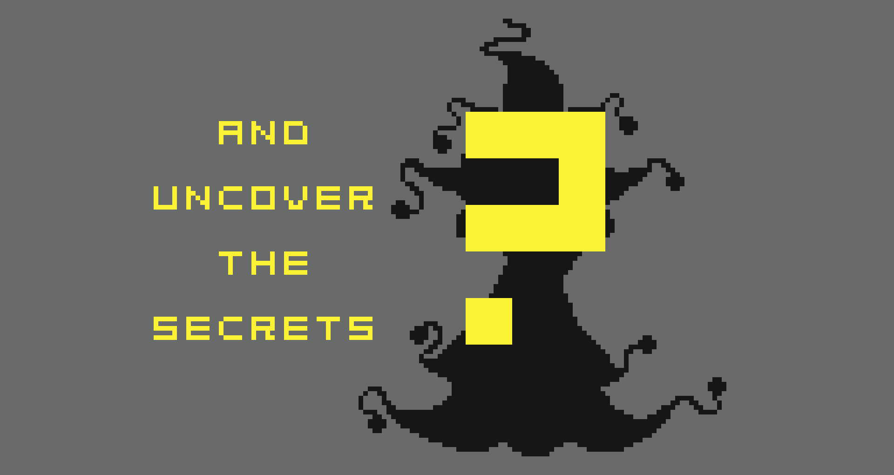

# Hatman

A classic 2D metroidvania with trichromatic artstyle.  You, a player, is a wandering spirit exploring a dark limbo-like realm. Fight your way through the enemies, discover secrets scattered generously through every map, gather power and defeat the ultimate Big Baddie! The game is extremely lightweight and should have FPS in hundreds/thousands on most machines.

## Screenshots

TODO:

## Executable

Pre-built binaries are available at the corresponding [itch.io page](https://hatmangame.itch.io/hatman-adventure) for:
- Windows x64

## Guides

- [Building the project]()
- 

## Dependencies

| Dependency                                   | License                                                      | Used for                        | Type        | Build process                     |
| -------------------------------------------- | ------------------------------------------------------------ | ------------------------------- | ----------- | --------------------------------- |
| [SFML](https://github.com/SFML/SFML)         | [zlib](https://github.com/SFML/SFML/blob/master/license.md)  | Graphics, audio, input handling | Third party | Fetched by CMake `FetchContent()` |
| [UTL](https://github.com/DmitriBogdanov/UTL) | [MIT](https://github.com/DmitriBogdanov/UTL/blob/master/LICENSE.md) | JSON                            | First party | Fetched by CMake `FetchContent()` |

## Changelog

See [`changelog.md`](./changelog.md) for a detailed development history.

## Some history

This game was my first truly large personal project. The codebase underwent several style changes, switched multiple dependencies (SDL, tinyxml ➞ SDL, simple_audio, nlohmann_json, SFML ➞ SFML, UTL) and changed scope several times. Despite some questionable practices in its development, this project went a long way in terms of my personal improvement as a specialist due to sheer coverage and scale of building a fully custom game engine.

After a few years I went back to clean up the build system, add some documentation, fix a few bugs, adjust some nit-picks, cull dependencies and set up proper CMake with a Linux build using the experience from developing [UTL](https://github.com/DmitriBogdanov/UTL).

## License

This project is licensed under the MIT License - see the LICENSE.md file for details
