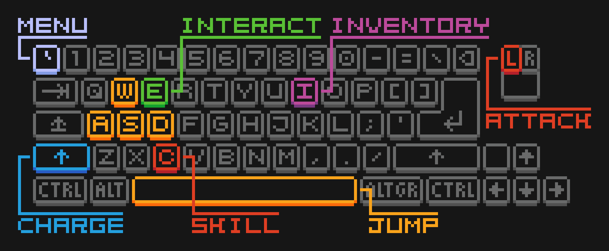
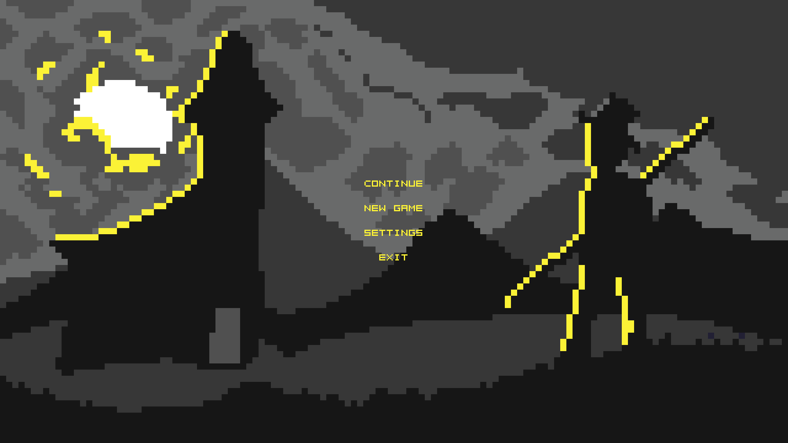
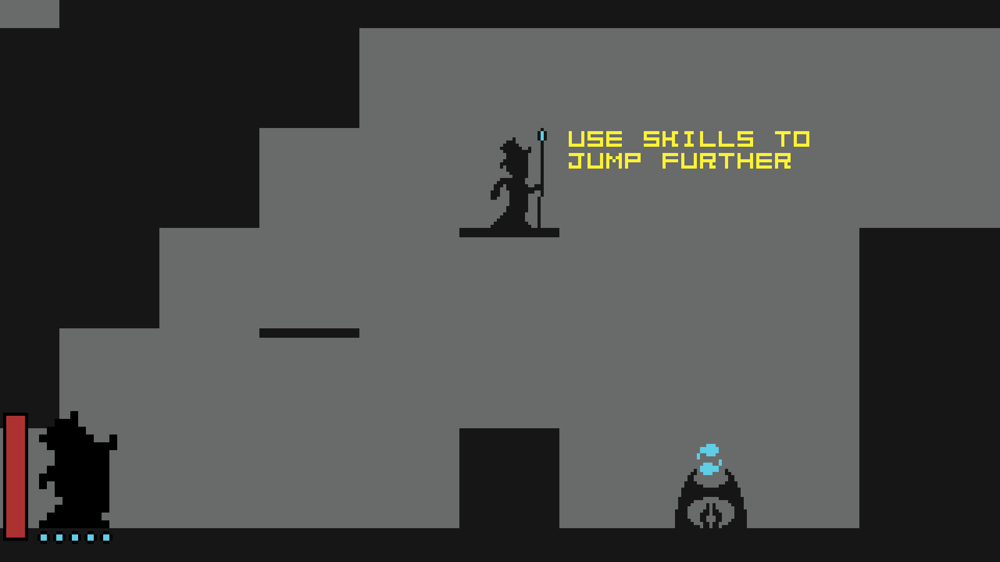
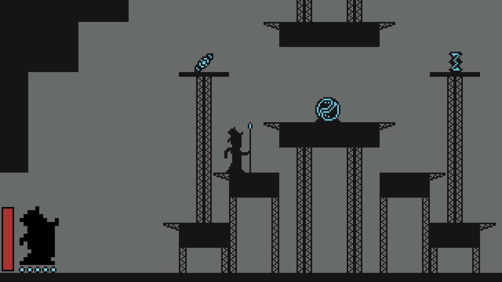
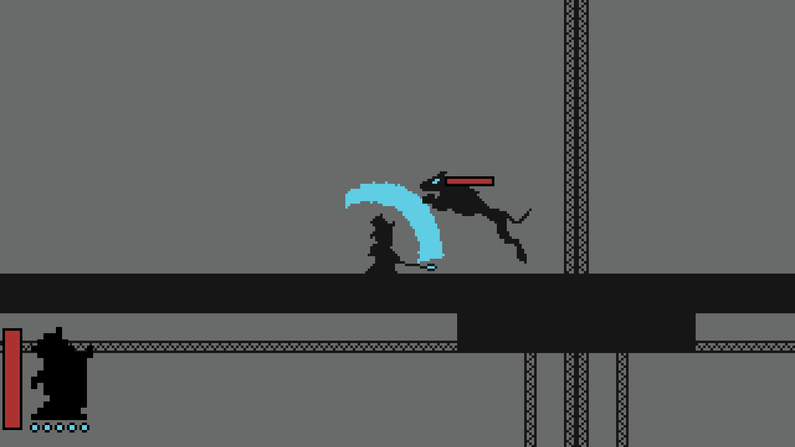
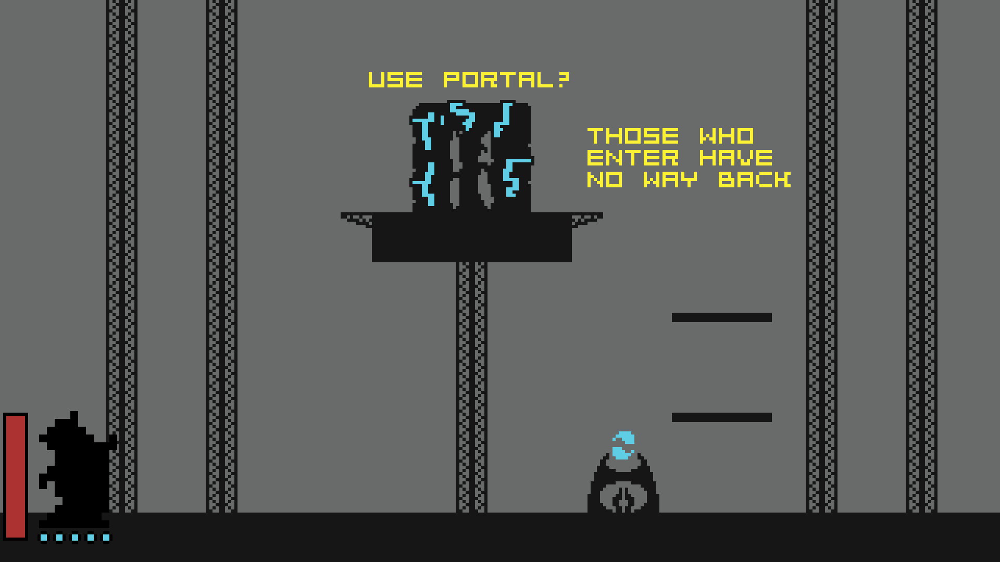
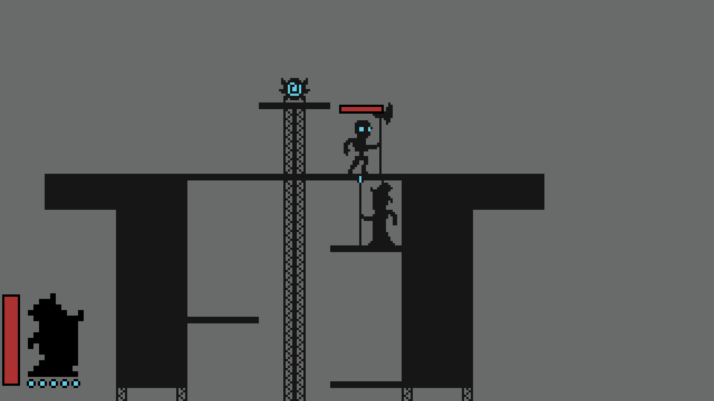
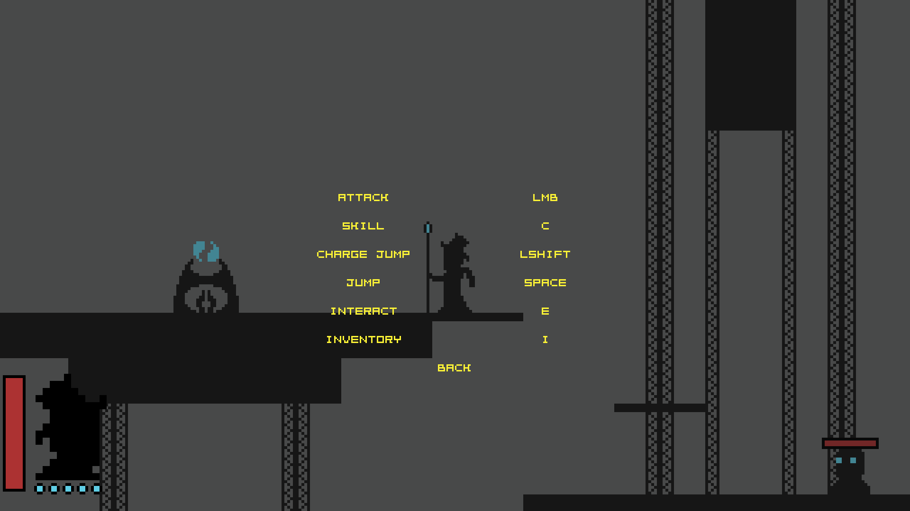
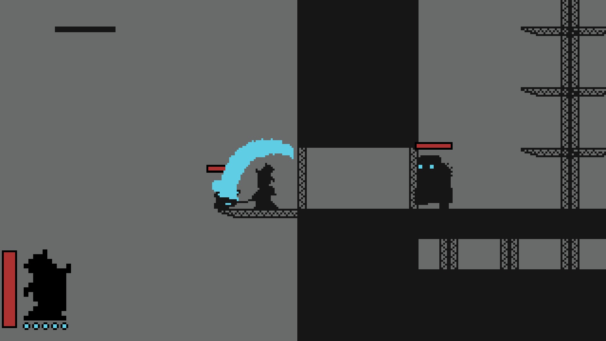

# Hatman

A classic 2D metroidvania with trichromatic artstyle.  You, a player, is a wandering spirit exploring a dark limbo-like realm. Fight your way through the enemies, discover secrets scattered generously through every map, gather power and defeat the ultimate Big Baddie! The game is extremely lightweight and should have FPS in hundreds/thousands on most machines.

## Gameplay

**The player character** is a spirit trying to escape its limbo-like realm by moving forward through **an increasingly dangerous world**.

**The world** itself is comprised of **12 distinct maps**, each map contains several safe zones that function as checkpoints.

**Map progression** is mostly linear, each map contains a multitude of secrets and optional pathways that **reward exploration**.

**Power progression** is based around **finding stat-boosting artifacts** during the exploration, these artifacts are crucial for being able to handle late-game enemies.

**The combat system** is mostly based around methodically **dodging enemy attacks** and striking during the safe window.

**Movement system** follows a rather standard 2D platforming scheme, **charged jumps and short-range teleportation** based on a limited energy bar are required to reach many locations.

## Controls

> [!Note]
> This is a showcase, all controls can also be **found in-game**. 

## Screenshots

## Executable

Pre-built binaries are available at the corresponding [itch.io page](https://hatmangame.itch.io/hatman-adventure) for:
- Windows x86-64
- Linux x86-64 **(TODO)**

## Guides

- [Building the project](./docs/guide_building_the_project.md)
- [In-game debug mode](./docs/guide_debug_mode.md)
- [Asset credits](./docs/guide_asset_credits.md)

## Wiki (contains spoilers)

- [Levels](./docs/wiki_levels.md)
- [Artifacts](./docs/wiki_artifacts.md)
- [Bestiary](./docs/wiki_bestiary.md)

## Dependencies

| Dependency                                   | License                                                      | Used for                        | Type        | Build process                     |
| -------------------------------------------- | ------------------------------------------------------------ | ------------------------------- | ----------- | --------------------------------- |
| [SFML](https://github.com/SFML/SFML)         | [zlib](https://github.com/SFML/SFML/blob/master/license.md)  | Graphics, audio, input handling | Third party | Fetched by CMake `FetchContent()` |
| [UTL](https://github.com/DmitriBogdanov/UTL) | [MIT](https://github.com/DmitriBogdanov/UTL/blob/master/LICENSE.md) | JSON                            | First party | Embedded in repo                  |

## Changelog

See [`CHANGELOG.md`](./changelog.md) for a detailed development history.

## Project history

This game was my first truly large personal project. The codebase underwent several style changes, switched multiple dependencies (SDL, tinyxml ➞ SDL, simple_audio, nlohmann_json, SFML ➞ SFML, UTL) and changed scope several times. Despite some questionable practices in its development (including the **incredibly** inconsistent style), this project went a long way in terms of my personal improvement as a specialist due to sheer coverage and scale of building a fully custom game engine.

After a few years I went back to clean up the build system, add some documentation, fix a few bugs, adjust some nit-picks, cull dependencies and set up proper CMake with a Linux build using the experience gained from developing [UTL](https://github.com/DmitriBogdanov/UTL).

## License

This project is licensed under the MIT License - see the [LICENSE.md](./LICENSE.md) for details.
