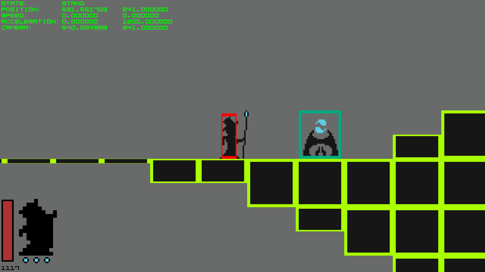

# In-game debug mode

[<- to README.md](..)

In-game debug mode can be toggled with **F3**. Debug mode includes following information:

- FPS
- Solid objects
- Entity hitboxes
- Interactive hitboxes
- Current state of the player entity
- Player position, speed & acceleration
- Camera position

This is exceedingly useful for debugging and testing mechanics.

**Showcase:**

