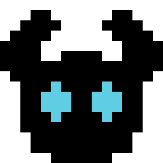

# Wiki / Artifacts

[<- to README.md](..)

> [!Warning]
> This page contains spoilers

Artifacts are collectible items scattered throughout every map, they provide significant bonuses to the player strength and mobility. A solid collection enough makes late-game enemies and bosses significantly easier to clear.

## Eldritch Battery

|  | The most merciful thing in the world is the inability of human mind to comprehend the contents of that thing. |
| - | - |
| **Effect:** | Health regeneration is increased by 10% (additive) |

## Spider Signet

|  | Twisting and skittering, yet static the when observed. |
| - | - |
| **Effect:** | Increases charged jump impulse by 8% (additive) |

## Power Shard

|  | The might of arcane, trapped in an intricate lattice. |
| - | - |
| **Effect:** | Increase damage of attacks by 10% (additive) |

## Bone Mask

|  | No mind to think. No will to break. No voice to cry suffering. |
| - | - |
| **Effect:** | Reduces incoming physical damage by 20% (multiplicative) |

## Magic Negator

|  | A steaming unholy contraption beats like a heart. |
| - | - |
| **Effect:** | Reduces incoming magic damage by 20% (multiplicative) |

## Twin Souls

|  | Independent, yet inseparable – two halves, chained together in a face of chaos. |
| - | - |
| **Effect:** | Reduces incoming chaos damage by 20% (multiplicative) |

## Watching Eye

|  | Concealed within this shell, the lord of hunger sees all. His gaze pierces cloud, shadow, earth, and flesh. |
| - | - |
| **Effect:** | Increases the number of charges by 1 |