# Wiki / Bestiary

[<- to README.md](..)

> [!Warning]
> This page contains spoilers

A listing of all enemies in the game.

See [levels](./wiki_levels.md) for the details on the enemy spread.

## Sludge

|  | A part of any landscape. |
| - | - |
| **Description:** | The most basic enemy. Moderate health. Slowly crawls to the player, deals damage upon contact. |

## Worm

| 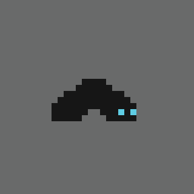 | Dwells in the deepest and filthiest of places. |
| - | - |
| **Description:** | Weak enemy that dies from a single attack. Usually encountered in large groups. Despite their low individual power, these critters can quickly devour prey due to their sheer number. |

## Devourer

| 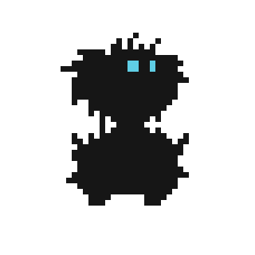 | The beast attacks whoever dares to turn away his gaze. |
| - | - |
| **Description:** | Dangerous melee fighter that quickly closes the gap once the player is not facing it. Will retaliate when attacked from the front. Quick glances can be used to move away while still keeping them from attacking. |

## Skeleton Halberd

| 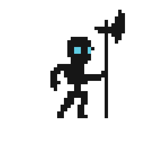 | The guard stands tall, for his duty is everlasting. |
| - | - |
| **Description:** | Common and moderately dangerous enemy. Its attacks have long and predicable windups but deal significant damage. |

## Pygmy Warrior

| 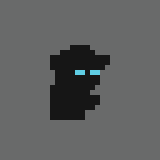 | This small but fierce warrior wields a shard knife and has no qualms about violence. |
| - | - |
| **Description:** | Fast enemy with moderate health. Attacks its enemies with quick stabs that deal significant damage. |

## Spirit Bomber

| 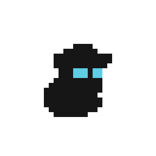 | Frail but proficient in magic, these creatures attack from afar. |
| - | - |
| **Description:** | Ranged enemy that throws explosive balls of magic. Attacks have a relatively AOE effect and can be blocked by terrain. Frail but can deal significant damage. |

## Golem

| 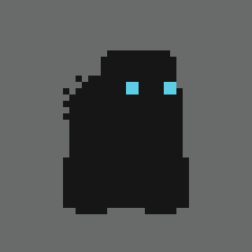 | A hulking giant, a construct made to protect what is sacred. |
| - | - |
| **Description:** | Slow and tough enemy. Almost immune to knockback. Doesn’t pose much danger alone but serves as a tough frontline in groups. |

## Hellhound

| 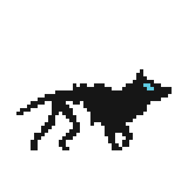 | Used to guard the most vile of places, this skeletal beast is as fast as it is lethal. |
| - | - |
| **Description:** | Extremely tough and fast enemy. Attacks by jumping through the target and striking it with a quick bite. Its attacks can be dodged by jumping or teleporting though them at the right moment. |

## Tentacle

| 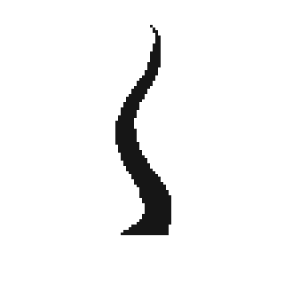 | These squirming shadows were always considered a harbinger of madness, or, perhaps, a source of its knowledge. |
| - | - |
| **Description:** | Stationary enemy that deals damage upon contact. Usually works as an area-of-denial in conjunction with other enemies. |

## Cultist

| 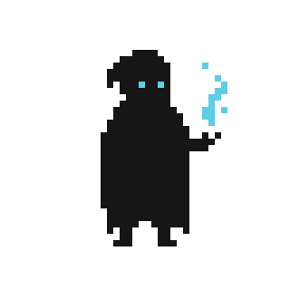 | Some goals are beyond sensible understanding. |
| - | - |
| **Description:** | Ranged enemy that summons terrain-piercing fireballs under the player. Easy to dodge, but deals significant damage on hit. |

## Necromancer

| 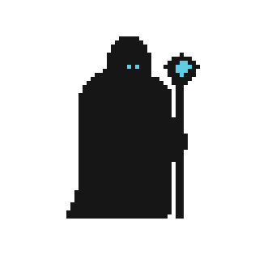 | For him death is more of an inconvenience. |
| - | - |
| **Description:** | Tough enemy that constantly summons `Worms` and `Sludges`. Can overrun the player unless taken out quickly. |

## The Cult Leader

| 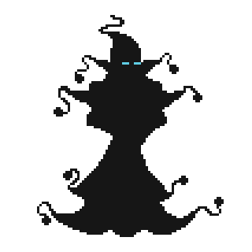 | In his rare dealings with mortals, he often chooses to appear as a grotesque mass of tentacles. |
| - | - |
| **Description:** | Unique enemy that takes multiple forms before it can be finally defeated. |