# Wiki / Levels

[<- to README.md](..)

> [!Warning]
> This page contains spoilers

The game world can represented as a graph of connected locations:

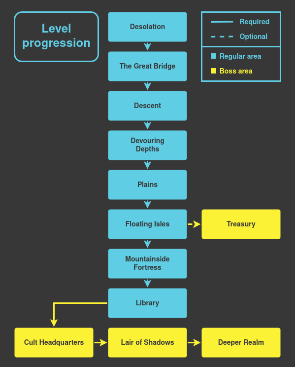

All locations except for the last **3** contain optional paths and secrets that reward player exploration with artifacts. A thorough exploration makes late-game enemies and bosses significantly easier to clear.

Many of the secrets are based around being able to find dropdowns and hidden jumps based on the environment clues, such as, for example, a portal exit with seemingly no corresponding entrance, or a drop near the saving orb, which allows player to scout the location without losing much progress.

### Desolation

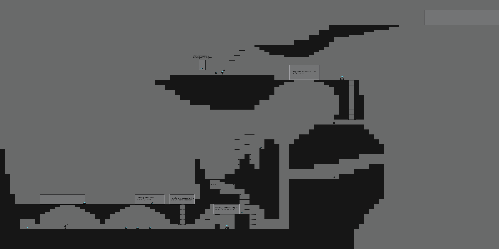

First level of the game, teaches basic mechanics to the player.

**Goes to:** `The Great Bridge`

### The Great Bridge

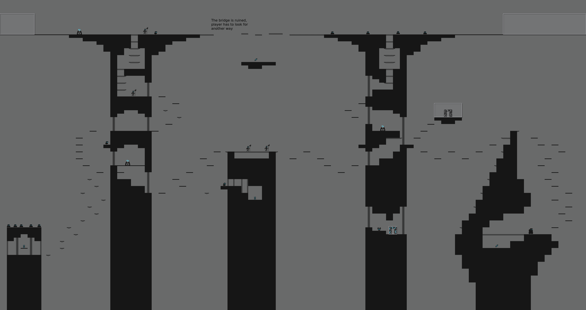

Second level, significantly more difficult, involves a lot of platforming and contains many optional paths.

**Entered from:** `Desolation`

**Goes to:** `Descent`

### Descent

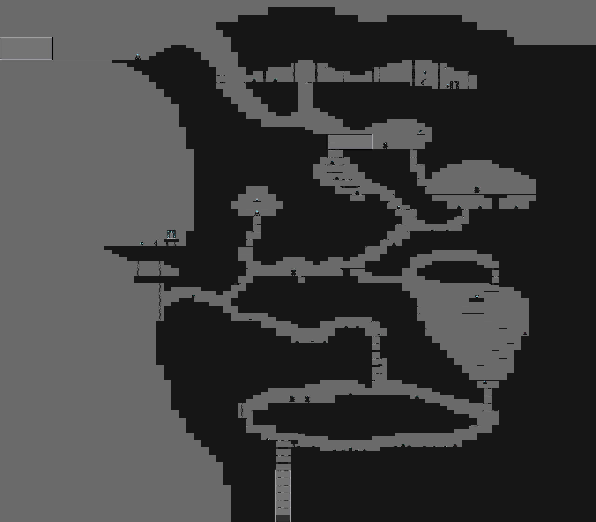

A long descent down to the `Devouring Depths`.

**Entered from:** `The Great Bridge`

**Goes to:** `Devouring Depths`

### Devouring Depths

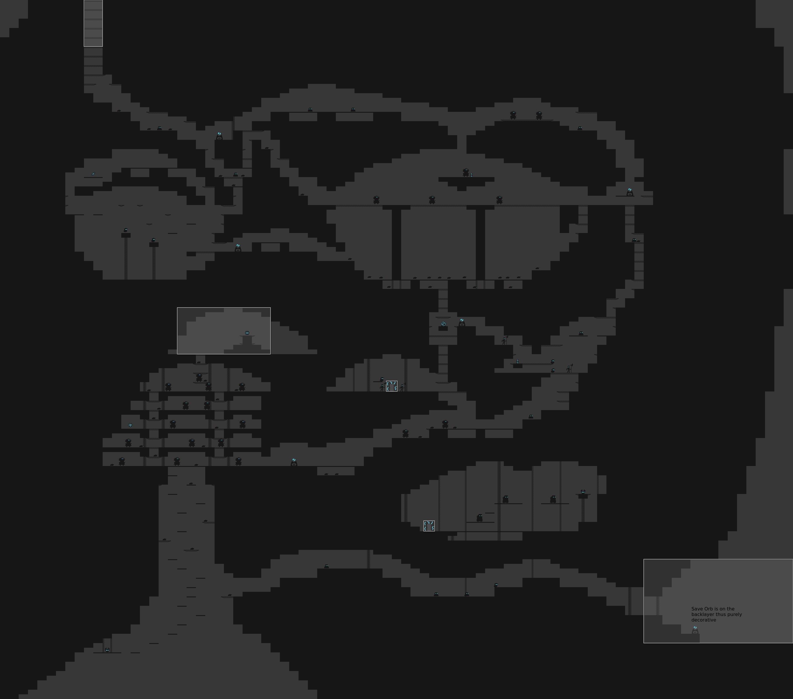

A long sprawling level with a lot of optional rooms and branching. Due to the depth, little light reaches this place. Contains a lot of `Worm` and `Devourer` enemies.

**Entered from:** `Descent`

**Goes to:** `Plains`

### Plains

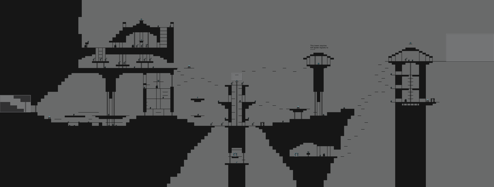

A mostly flat level covered in pygmy fortifications. A lot of `Skeleton Halberd`, `Pygmy Warrior` and `Spirit Bomber` enemies. Some paths can only be taken by a player that has collected enough `Spider Signets` to reach them. 

**Entered from:** `Devouring Depths`

**Goes to:** `Floating Isles`

### Floating Isles

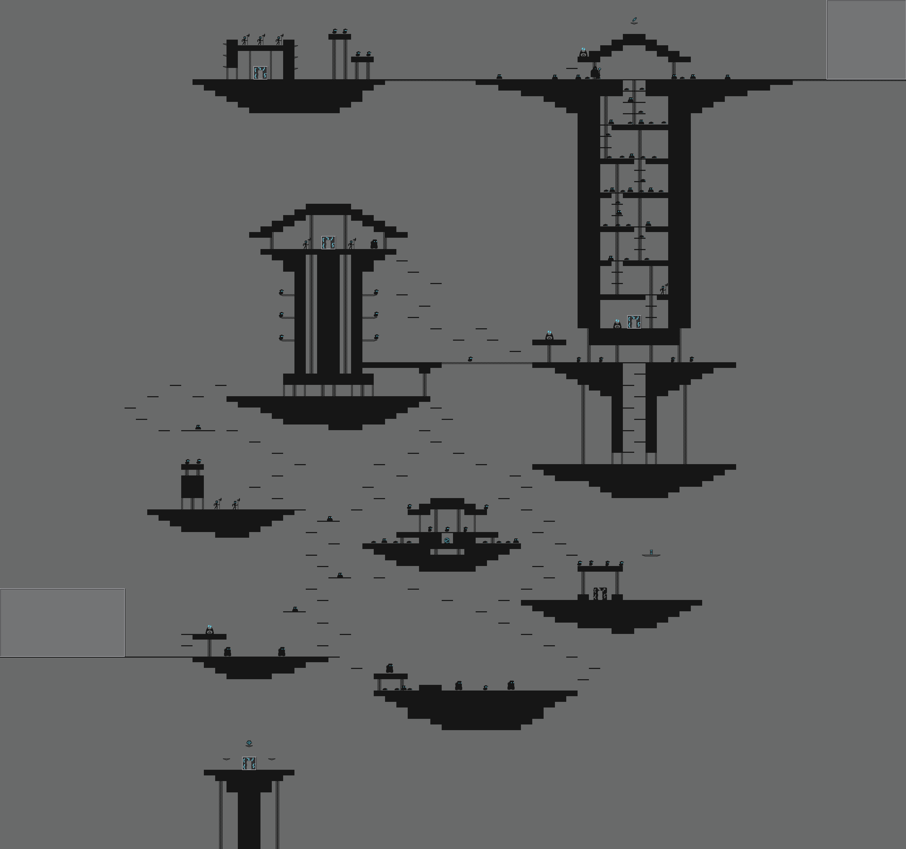

Floating islands covered in an assortment of challenging setups. Some artifacts can only be gathered by a player that has collected enough `Spider Signets` to reach them. Contains an entrance to an **optional boss location**.

**Entered from:** `Plains`

**Goes to:** `Mountainside Fortress`, `Treasury`

### Treasury

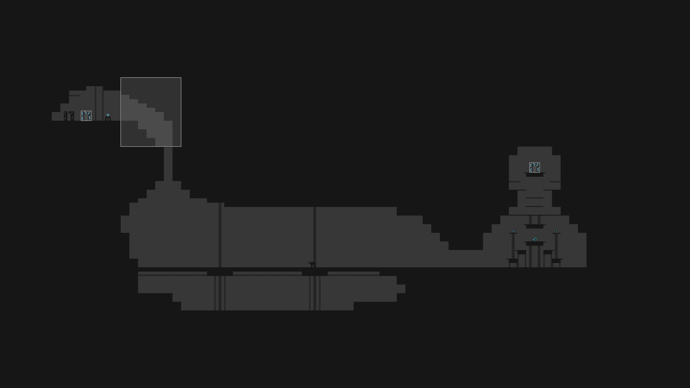

**Optional** location housing an ample reward guarded by a `Hellhound`.

**Entered from:** `Floating Isles`

### Mountainside Fortress

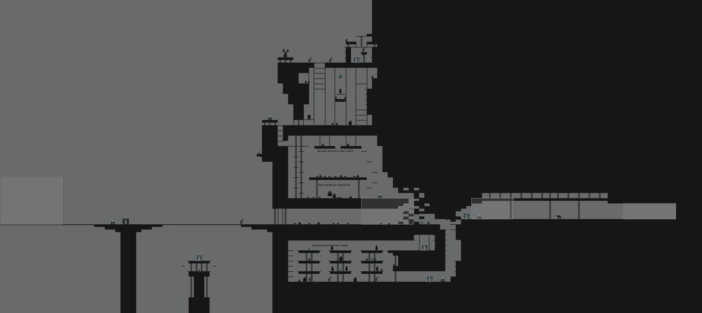

Location combining dungeons and multi-layered fortifications, contains a lot of combat and introduces some strong enemy types. `Hellhound` guards the entrance to the `Library`.

**Entered from:** `Floating Isles`

**Goes to:** `Library`

### Library

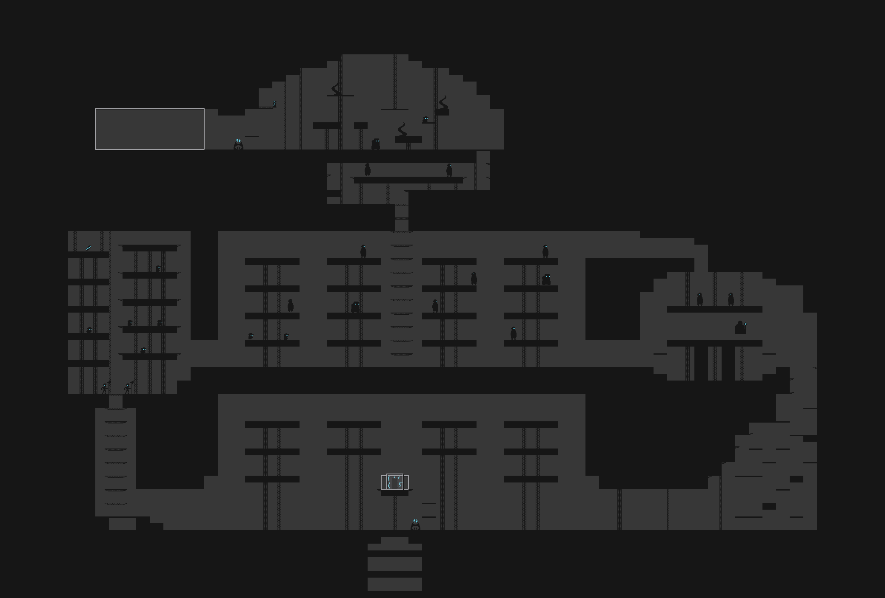

The last non-boss location. Multi-layered layout with a lot of `Cultist` and `Necromancer` enemies.

**Entered from:** `Mountainside Fortress`

**Goes to:** `Cult Headquarters`

### Cult Headquarters, Lair of Shadows & Deeper Realm

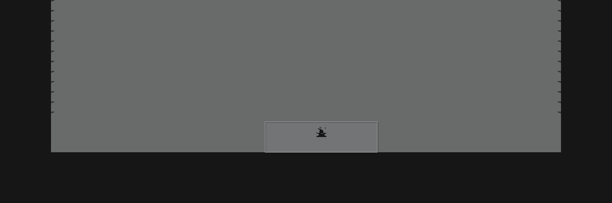

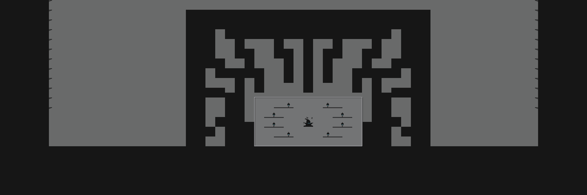

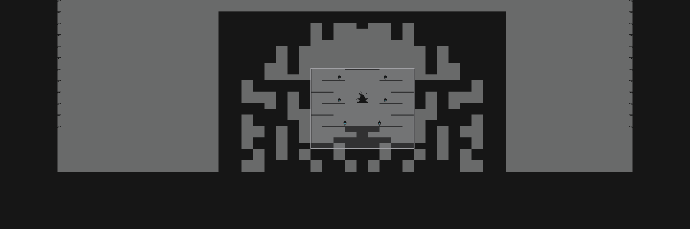

A chain of three locations corresponding to the 3 phases of the final boss.

During the **1st phase** the boss glides away from the player while spawning periodic reinforcements and attacking with shadow tentacles.

For the **2nd phase** the mage teleports player to an enclosed location. The boss stays stationary in the center, surrounding platforms contain orbs which can be destroyed to deal significant damage. During this phase the player is constantly bombarded with a stream of projectiles in addition to periodic tentacle attacks that try to disrupt player movement, baiting them into a projectile.

In the final **3rd phase** a similar process is repeated in another arena. During this phase the boss also launches circular waves of explosive projectiles, the player needs to use their environment in order to escape these waves as each projectile deals significant damage on hit.

**Entered from:** `Library`